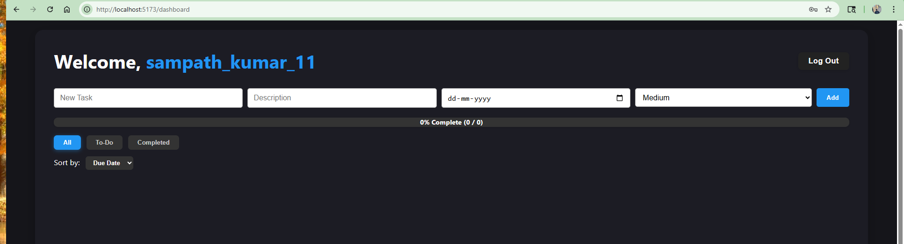

# To-Do Application with Django, React, and MySQL

A **Full-Stack To-Do Application** built with **Django** (backend), **React.js** (frontend), and **MySQL** database. Designed to support task management with user authentication, overdue task tracking, and automated email reminders.

---

## Key Features

* **User Authentication:** JWT-based login and registration (bonus API for user signup).
* **Task Management:** Add, update, delete tasks with title, description, due date, priority, and completion status.
* **Overdue Task Detection:** Backend logic to retrieve overdue tasks for the authenticated user.
* **Automated Email Notifications:** Email reminder when a task is due within the next 1 hour using Django signals.
* **Frontend Interface:**

  * Task input, progress tracking, filtering by completion status.
  * Priority highlighting (High/Medium/Low).
  * Visual cue for overdue tasks.
  * Mobile responsive UI/UX.
  * Sorting by due date and priority (Bonus enhancement).

---

## High-Level Architecture

```
+-------------------+        +-----------------+        +---------------------+
|   React Frontend  | <----> |  Django Backend | <----> |    MySQL Database    |
+-------------------+        +-----------------+        +---------------------+
        |                            |                            |
        |--- JWT Authentication ---> |                            |
        |<-- Task APIs (CRUD) ------> |                            |
        |<-- Overdue Tasks API ------|                            |
        |                            |--- ORM Queries ----------> |
        |                            |                            |
        |                            |--- Email Notification ----|
```

* **Frontend (React.js):** User interactions, API communication, UI rendering.
* **Backend (Django + DRF):** API exposure, business logic, signals for emails.
* **Database (MySQL):** Persistent storage for users and tasks.

---

## Tech Stack Used

| Layer          | Technology                                    |
| -------------- | --------------------------------------------- |
| Frontend       | React.js + Vite                               |
| Backend        | Django 5.x, Django REST Framework             |
| Database       | MySQL                                         |
| Authentication | JWT (via Simple JWT package)                  |
| Email          | Django's Email Backend (console-based in dev) |

---

## API Endpoints List

| Method | Endpoint              | Purpose                   |
| ------ | --------------------- | ------------------------- |
| POST   | `/api/auth/register/` | Register new user (Bonus) |
| POST   | `/api/auth/login/`    | Obtain JWT tokens         |
| POST   | `/api/auth/refresh/`  | Refresh JWT tokens        |
| GET    | `/api/tasks/`         | List all tasks            |
| POST   | `/api/tasks/`         | Create new task           |
| PATCH  | `/api/tasks/{id}/`    | Update a task             |
| DELETE | `/api/tasks/{id}/`    | Delete a task             |
| GET    | `/api/tasks/overdue/` | Retrieve overdue tasks    |

---

## Setup Instructions

### 1. Backend (Django)

```bash
git clone https://github.com/youruser/todo-app.git
cd todo-app/backend
```

* **Setup virtual environment**

```bash
python -m venv .venv
.\.venv\Scripts\activate
```

* **Install dependencies**

```bash
pip install -r requirements.txt
```

* **Configure Database in `.env`** (Please Change credentials accordingly)

```
MYSQL_DB_NAME=todo_db
MYSQL_USER=root
MYSQL_PASSWORD=yourpassword
MYSQL_HOST=localhost
MYSQL_PORT=3306
DJANGO_SECRET_KEY=your_secret_key
```

* **Run migrations**

```bash
python manage.py migrate
```

* **Create superuser**

```bash
python manage.py createsuperuser
```

* **Run server**

```bash
python manage.py runserver
```

---

### 2. Frontend (React)

```bash
cd ../frontend
npm install
npm run dev
```

* The React frontend will be served on `http://localhost:5173/`.
* Ensure React proxies API requests to Django running on port 8000.

---

## Testing APIs via Thunder Client / Postman

* **Register:** POST `/api/auth/register/`
* **Login:** POST `/api/auth/login/`
* **Create Task:** POST `/api/tasks/`
* **List Tasks:** GET `/api/tasks/`
* **Update Task:** PATCH `/api/tasks/{id}/`
* **Delete Task:** DELETE `/api/tasks/{id}/`
* **Fetch Overdue Tasks:** GET `/api/tasks/overdue/`

Each request requires **Bearer Token** in headers.

---

## Email Reminder Logic

* When a task is created/updated with a due date within **1 hour from current time**, a signal triggers an **email reminder** to the user (For now visible in the console in development).
* Easily configurable for production SMTP services, future enhancement.

---

## UI/UX Highlights

* Progress bar reflecting completed tasks.
* Overdue tasks are visually highlighted in red.
* Priority badges:

  * Red for High
  * Orange for Medium
  * Blue for Low
* Filter by:

  * All Tasks
  * To-Do
  * Completed
* Sort by Due Date and Priority (Extra feature).
* Fully responsive design for mobile and desktop.

---

## Deployment Guide (Optional for now, Future UseCases)

* Backend can be deployed on **Render / Railway**.
* Frontend can be deployed on **Vercel**.
* For production:

  * Enable CORS for deployed frontend domain.
  * Configure database and static files.
  * Use production-grade email backend.

---

## Developer

**Sampath Kumar Kolichalam**
Project developed as part of **Bright Bridge Django Proficiency Assessment.**

---

## License

MIT License.

---

## 📸 Screenshots

### 1. Folder Structure

* **Backend & Frontend Directory**
  
  

### 2. Database Structure

* **Tasks Table**
  

* **Auth User Table**
  

* **Admin Logs**
  

### 3. Backend & Frontend Servers

* **Django Backend Running**
  

* **React Frontend Running**
  

### 4. API Testing via Thunder Client / Postman

* **User Registration**
  

* **Login API**
  

* **Token Refresh**
  

* **Create Task**
  

* **Get All Tasks**
  

* **Update Task**
  

* **Delete Task**
  

* **Overdue Tasks API**
  

### 5. Email Reminder Console Output


### 6. Frontend UI

* **Dashboard Overview**
  

* **Completed Tasks Filter**
  

* **To-Do Tasks Filter**
  

* **Priority, Progress & Filters**
  

### 7. Task List (Admin Panel)


---
